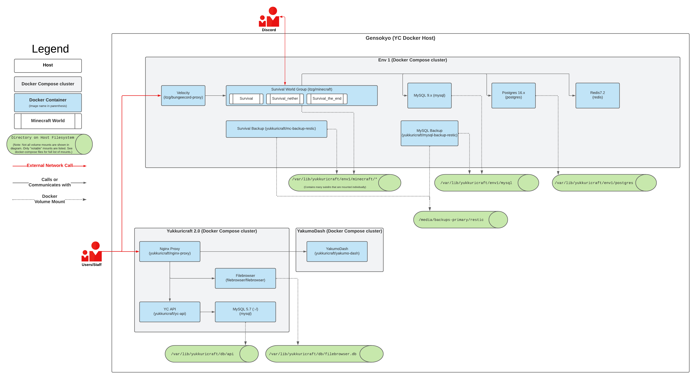

# Yukkuricraft

Containerized Yukkuricraft

## Developing
- See [Developing Locally](docs/developing_locally.md)
- Some directories are documented with their own `README.md`'s such as [src/README.md](src/README.md), [src/api/README.md](src/api/README.md), and [images/README.md](images/README.md).

## Architecture (WIP)

## Description

This is our attempt at containerizing the Yukkuricraft minecraft server utilizing `itzg/minecraft-server` and `itzg/mc-proxy` (Velocity).

This repo along with [YakumoDash](https://github.com/Yukkuricraft/YakumoDash) form a minecraft server management system utilizing Docker Compose with the ability to create, modify, and delete server "clusters". A "cluster" is a Velocity proxy fronted series of minecraft servers - Paper and Fabric supported atm - along with various auxiliary containers such as various databases, automated backup sidecars, etc.

This repo is the backend API utilizing Docker while `YakumoDash` is the frontend webapp.

### World Groups

To organize our worlds into individual servers, we do so using "world groups".

A "world group" represents a group of Minecraft worlds that are thematically related.

- Eg, 'survival', 'creative', and 'neo-gensokyo' worlds.

On the filesystem, a world group is represented as:

- `/var/lib/yukkuricraft/<ENV>/minecraft/<WORLD GROUP>/...`

We define our "enabled" world groups in a config - See [Environments and Containers](#environments-and-containers).

### `docker-compose.yml` Generation

Using our configured enabled world groups, we dynamically generate a `gen/docker-compose/docker-compose-{ENV}.yml` to run only the enabled groups.

- Sourcecode can be found under `src/generator/docker_compose_gen.py`

### Proxy, Config Generation, and Container Setup

We utilize the Velocity Minecraft proxy. Our individual servers are run in containers, each of which represents a world group.

The Velocity config is likewise dynamically generated as per enabled world groups.

- Sourcecode can be found under `src/generator/velocity_config_gen.py`

We also utilize a custom `scripts/start.sh` script to do some filesystem setup for us prior to starting the server. As such, we create a short `yukkuricraft/minecraft-server` image as defined in `images/minecraft-server/Dockerfile`, along with various other customized popular images.

## Environments and Containers

We configure our individual environments using appropriately named configs found under `env/env-toml/<ENV>.toml`. The config currently consists of the following sections:

1. The `cluster-variables` section which defines ENV VARS passed into `docker-compose` invocations. We use this TOML definition to dynamically generate a valid `.env` file for `docker-compose`.
  - Note: We inject some ENV VARS into this generated `.env` file, such as the `ENV` value which takes the ENV specified by the TOML filename.

2. The `world_groups` section which contains our "enabled world groups" config.

## See Also

- [Initial Thoughts - First Draft README](docs/initial_thoughts.md)
- [Thoughts on Plugin Management VCS](docs/plugin_vcs_management_thoughts.md)
