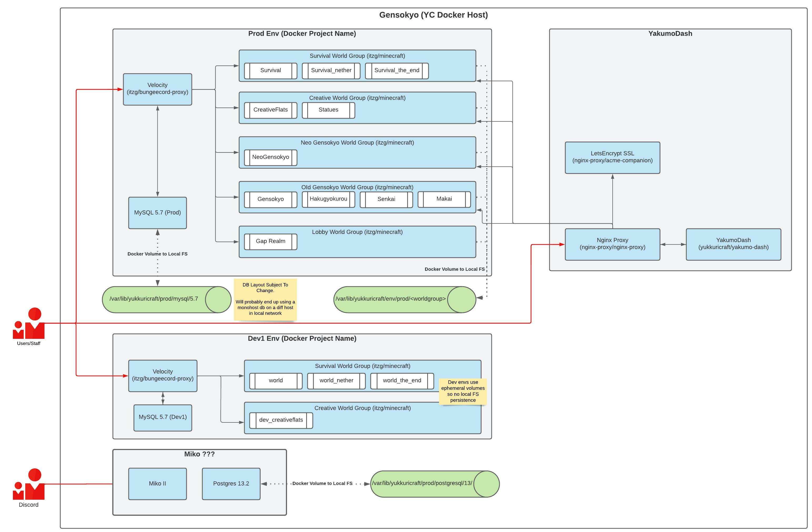
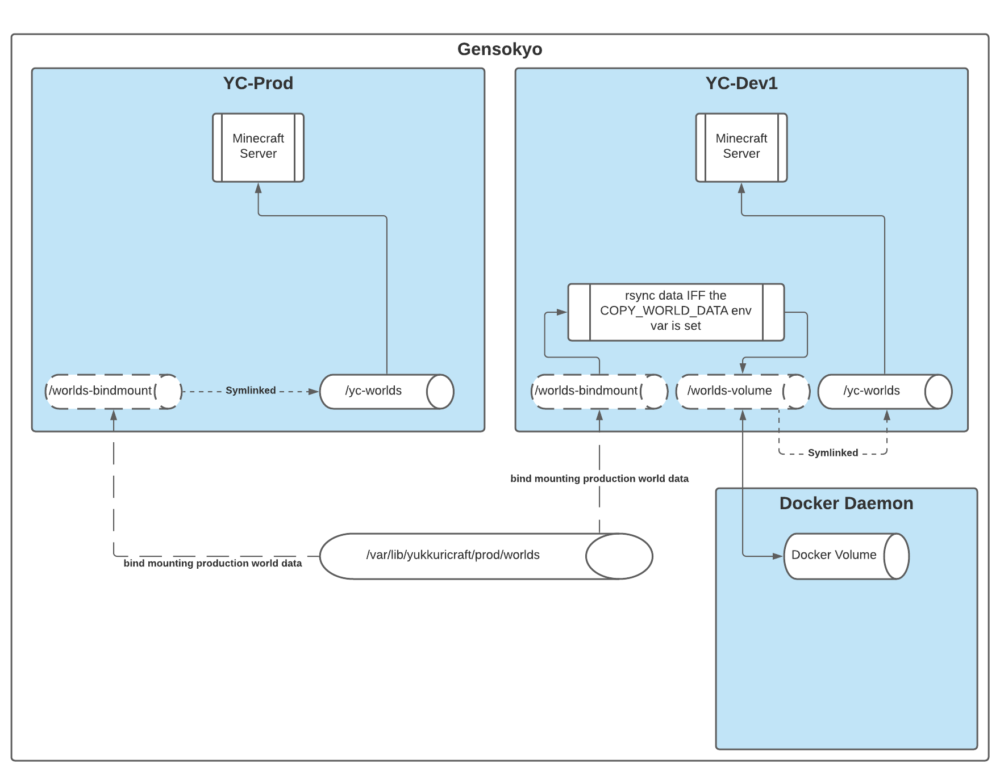

# Yukkuricraft
Containerized Yukkuricraft

## Architecture (WIP)

## Description

This is our attempt at containerizing the Yukkuricraft minecraft server utilizing `itzg/minecraft-server` and `itzg/bungeecord`.

We support two "types" of environments - `prod` and `dev`.
- The `prod` type env is a singular environment - ie only one prod.
- There can however be multiple `dev` type envs. We standardize our names as `dev#` where # is an int starting at 1.
- Eg, we can have environments named: `prod`, `dev1`, `dev2`

### World Groups

To organize our worlds into individual servers, we do so using "world groups".

A "world group" represents a group of Minecraft worlds that are thematically related.
- Eg, 'survival', 'creative', and 'neo-gensokyo' worlds.

On the filesystem, a world group is represented as:
- `/var/lib/yukkuricraft/<ENV>/<WORLD GROUP>/...`
- `./secrets/configs/<ENV>/<WORLD GROUP>/`
- The base paths can be configured in `env/<ENV>.env`

We define our "enabled" world groups in our Environment Configurations..

### `docker-compose.yml` Generation

Using our configured enabled world groups, we dynamically generate a `gen/docker-compose-{ENV}.yml` to run only the enabled groups.
- Sourcecode can be found under `src/generator/docker_compose_gen.py`

As a consequence, we encourage you to run things using `Makefile` commands. See [Running Containers](#running-containers). We are also in the works of creating [YakumoDash](https://github.com/Yukkuricraft/YakumoDash) to make server/env management easier.

### Proxy, Config Generation, and Container Setup

We utilize the Velocity (TBD) Minecraft proxy. Our individual servers are run in containers, each of which represents a world group.

The Velocity config is likewise dynamically generated as per enabled world groups.
- Sourcecode can be found under `src/generator/velocity_config_gen.py`

We also utilize a custom `scripts/start.sh` script to do some filesystem setup for us prior to starting the server. As such, we also create a short `yukkuricraft/minecraft-server` image as defined in `images/minecraft-server/Dockerfile`.

## Environments and Containers

We configure our individual environments using appropriately named configs found under `env/<ENV>.toml`. The config currently consists of the following sections:
1. The `runtime-environment-variables` section which defines ENV VARS passed into `docker-compose` invocations. We use this TOML definition to dynamically generate a valid `.env` file for `docker-compose`.
  - Note: We inject some ENV VARS into this generated `.env` file, such as the `ENV` value which takes the ENV specified by the TOML filename.
2. The `world_groups` section which contains our "enabled world groups" config.

Conceptually, the `prod` and `dev` environment **types** have a special relationship with each other.

Our production world data currently resides on the container host's filesystem as configured in the `env/prod.env` file. More specifically, our `docker-compose.yml` bind mounts this world data to the `/worlds-bindmount` directory inside the container. This is regardless of environment type.

Additionally, we configure the minecraft server to treat `/yc-worlds` as the path for all world data.

From here, behavior diverges based on environment type:

# EVERYTHING BELOW IS CONSIDERED OUTDATED

#### Prod
We simply symlink `/worlds-bindmount` to `/yc-worlds`. This effectively bindmounts the container host's production world data to the server world data path within the container. Thus, anytime the world data is saved on the production server, the world state should be written back to the host FS.

We recommend running the `make save_world` command for convenience when needing to immediately write world state to disk.

#### Dev
For development environments, we introduce two new "features".
- First, the world data used for dev environments are stored on a docker volume rather than binding to host FS.
- Second, we introduce the ability to toggle "Copy production world data" on startup with the correct flags set.

To accomplish this, we setup our volumes and mounts slightly differently from production:
- First, we bind mount the production world data to `/worlds-bindmount` same as production.
- Next, we create a docker volume mounted to `/worlds-volume`. This volume will contain all our world data used by the minecraft server.
- Finally, we create a symlink so `/yc-worlds` points to `/worlds-volume`.

This roundabout setup is necessary as we want to effectively use `/yc-worlds` as both a bind mount for production and a docker volume for development. Since we cannot configure docker-compose to use both, we instead use the `scripts/start.sh` script to setup our symlinks based on environment type.

#### Filesystem Diagram
Below is a diagram illustrating the paragraphs above pertaining to filesystem layouts

### Creating New Environments

To create new dev environments, simply create a corresponding `env/dev#.env` file. You can now use the new `dev#` in `make` commands, eg `make ENV=dev2 up`.

**Note**: You will get a freshly generated world unless you also add the `COPY_PROD_WORLD=1` flag, eg `make COPY_PROD_WORLD=1 ENV=dev2 up`.

## Running Containers

- All containers are named with the environment added as a suffix. Eg, `YC-prod`, `MySQL-prod`, `YC-dev`, etc
- All container management should generally be done using `Makefile` targets. **All commands by default will target the `dev1` environment.**
    - You may prepend an ENV var declaration to any `make` target to change the environment. Eg, `make ENV=prod up` or `make ENV=prod save_world`

Below are the commonly used commands:
|Command|Description|
|-------|-----------|
|`make build`|Builds the `yukkuricraft/minecraft-server` image which adds small setup scripts to `itzg/minecraft-server`.|
|`make up`|Starts the server on the specified environment.|
|`make COPY_PROD_WORLD=1 ENV=dev1 up`|Assuming the ENV is a non-production env, setting `COPY_PROD_WORLD` to a **non-empty value** will run an `rsync` from `/worlds-bindmount` (production world data) to `/worlds-volume` (container-specific volume mount). This effectively performs a one-time ro mirror of the production data to our dev world. Because we use volumes, the first `rsync` will take time as it is copying the entire world. However, subsequent runs should be much faster (assuming volumes have not been pruned) as we only `rsync` new or modified files.|
|`make down`|Kills containers in the specified environment.|
|`make logs`|Runs `docker-compose logs` for the specified environment's containers.|
|`make attach`|Runs `docker attach` to the `YC-${ENV}` container. **This is attaching to Console.** Be aware that `Ctrl+C` kills the server. Detaching is done with `Ctrl+P`, then `Ctrl+Q`.|
|`make purge`|Purges all docker volumes that are not in use. Must down containers first.|
|`make save_world`|Runs `save-all` inside the console of the `YC-${ENV}` container. **Writes the world to disk.**|

There are `_prod` suffixed variants for most targets which simply sets `ENV=prod` for each target.
- Eg, `make up_prod`, `make down_prod`

See the contents of `Makefile` for a full list of valid targets.

## Outstanding Questions
- Logs?
- Plugins and configs?

## See Also
- [Initial Thoughts - First Draft README](docs/initial_thoughts.md)
- [Thoughts on Plugin Management VCS](docs/plugin_vcs_management_thoughts.md)
